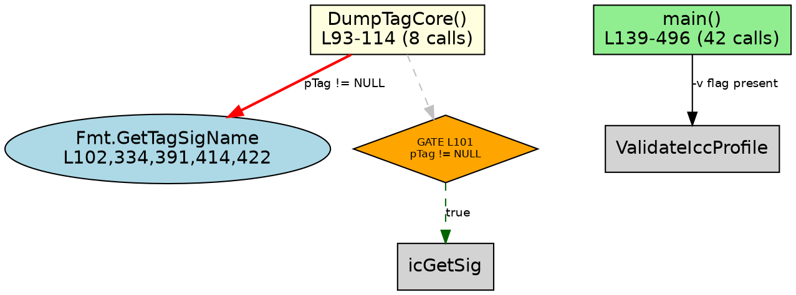

# Call Graph Infrastructure - Detailed Examination

## Overview
The existing call graph infrastructure consists of three layers:
1. **Python Scripts** (.github/scripts/callgraphs/) - Static analysis scripts for each iccDEV tool
2. **C++ Library** (iccanalyzer-lite/IccAnalyzerCallGraph.*) - Runtime ASAN/UBSAN log parsing and visualization
3. **Generated Reports** (analysis-reports/callgraph-*/) - Static analysis output with DOT, JSON, and SVG

---

## 1. Python Script Layer

### Location
`/home/h02332/po/research/.github/scripts/callgraphs/`

### Scripts (11 total)
- iccApplyNamedCmm-callgraph.py
- iccApplyProfiles-callgraph.py
- iccApplyToLink-callgraph.py
- iccDumpProfile-callgraph.py
- iccFromCube-callgraph.py
- iccFromXml-callgraph.py
- iccRoundTrip-callgraph.py
- iccSpecSepToTiff-callgraph.py
- iccTiffDump-callgraph.py
- iccToXml-callgraph.py
- iccV5DspObsToV4Dsp-callgraph.py

### Pattern & Structure (iccDumpProfile-callgraph.py example)

#### **Data Model** (lines 29-64)
```python
@dataclass
class CallSite:
    callee: str          # API/function name
    line: int            # Source line number
    caller: str          # Function that calls it
    context: str         # Surrounding code snippet
    gate: str            # Controlling condition
    is_indirect: bool    # Whether call is indirect
    cli_only: bool       # True if only in CLI, not fuzzer

@dataclass
class ASTGate:
    condition: str       # Gate condition (e.g., "pTag != NULL")
    line: int            # Source location
    gate_type: str       # "if", "else", "switch-case", "ternary"
    parent_func: str     # Enclosing function
    true_calls: list     # Calls on true branch
    false_calls: list    # Calls on false/else
    depth: int           # Nesting depth
    security_relevant: bool
    note: str            # Explanation

@dataclass
class FunctionDef:
    name: str
    line_start, line_end: int
    params, return_type: str
    calls: list[CallSite]
    gates: list[ASTGate]
```

#### **Data Structures** (lines 67-77)
- **FUNCTIONS**: Hand-verified function definitions from source
  ```python
  FunctionDef("DumpTagCore", 93, 114, "CIccTag *pTag, ...", "void")
  FunctionDef("main", 139, 496, "int argc, char* argv[]", "int")
  ```

- **CALL_SITES**: Every API call with source location and gate condition
  ```python
  CallSite("Fmt.GetTagSigName", 102, "DumpTagCore", gate="pTag != NULL")
  CallSite("ValidateIccProfile", 198, "main", gate="-v flag present")
  ```

- **AST_GATES**: Conditional branches controlling code paths
  ```python
  ASTGate("pTag != NULL", 101, "if", "DumpTagCore",
          true_calls=[...], false_calls=[...],
          security_relevant=True)
  ```

#### **Key Metrics Tracked**
- Function call count per function
- Gate count (total & security-relevant)
- CLI-only calls (excluded from fuzzer fidelity)
- Fuzzable vs matched calls (fidelity percentage)

---

## 2. C++ Call Graph Library

### Location
`/home/h02332/po/research/iccanalyzer-lite/IccAnalyzerCallGraph.{h,cpp}`

### Header (IccAnalyzerCallGraph.h - 121 lines)

**Data Structures:**
```cpp
struct CallGraphNode {
    std::string m_function_name;
    std::string m_file_path;
    unsigned int m_line_number;
    std::vector<CallGraphNode*> m_callers;
    std::vector<CallGraphNode*> m_callees;
    bool m_is_crash_site;
    bool m_is_entry_point;
};

struct ASANFrame {
    unsigned int m_frame_num;
    std::string m_function_name;
    std::string m_file_path;
    unsigned int m_line_number;
    bool m_is_crash;
};

struct VulnMetadata {
    std::string m_error_type;      // e.g., "stack-buffer-overflow"
    std::string m_access_type;     // READ/WRITE
    unsigned int m_access_size;    // bytes
    std::string m_address;         // hex address
    std::string m_var_name;        // variable name if available
    unsigned int m_var_size;       // variable size
    unsigned int m_overflow_bytes; // overflow distance
};
```

**Main API:**
```cpp
bool ParseASANLog(const char* log_file, std::vector<ASANFrame>& frames, 
                  VulnMetadata& metadata);
bool ParseUBSANLog(const char* log_file, std::vector<ASANFrame>& frames, 
                   VulnMetadata& metadata);
bool GenerateDOTGraph(const std::vector<ASANFrame>& frames, 
                      const char* output_file);
bool ExportJSON(const std::vector<ASANFrame>& frames, 
                const VulnMetadata& metadata, const char* output_file);
bool ExportGraph(const char* dot_file, const char* output_file, 
                 const char* format);  // PNG/SVG/PDF
bool AnalyzeExploitability(const VulnMetadata& metadata, 
                           const std::vector<ASANFrame>& frames);
void PrintCallChainTree(const std::vector<ASANFrame>& frames, 
                        const VulnMetadata& metadata);
```

### Implementation (IccAnalyzerCallGraph.cpp - 698 lines)

#### **ParseASANLog** (lines 66-169)
Parses ASAN crash logs using regex:
- **Error signature regex**: `"ERROR: AddressSanitizer: ([^\s]+)"`
- **Access info regex**: `"(READ|WRITE) of size (\d+)"`
- **Address regex**: `"on address (0x[0-9a-f]+)"`
- **Stack variable overflow**: `"\[(\d+), (\d+)\) '([^']+)'.*<== Memory access at offset (\d+)"`
- **Frame parsing regex**: `"\s*#(\d+)\s+0x[0-9a-f]+\s+in\s+(.+?)\s+([^\s:]+\.(?:cpp|c|cc|cxx|h|hpp)):(\d+)"`

**Key features:**
- Stops at "allocated by"/"freed by" boundaries
- Handles template parameter stripping: `<[^>]*>` → `<>`
- Extracts basename from file paths
- Safe integer parsing with fallback (`safe_stoi()`)

#### **GenerateDOTGraph** (lines 172-245)
Generates Graphviz DOT format:
- **Header**: `digraph CallChain { rankdir=TB; ... }`
- **Nodes**: One per frame with color coding
  - Entry point: `lightgreen`
  - Crash: `red`
  - Before crash: `orange`
  - Default: `lightblue`
- **Edges**: Frame-to-frame with red pen for crash edge
- **Labels**: Function name, file:line, CRASH marker

#### **ExportJSON** (lines 584-623)
Generates minimal JSON with:
```json
{
  "error_type": "stack-buffer-overflow",
  "access_type": "WRITE",
  "access_size": 8,
  "variable": "buffer_name",
  "var_size": 256,
  "overflow_bytes": 4,
  "call_chain_depth": 6,
  "frames": [
    {"frame": 0, "function": "func1", "file": "f.cpp", 
     "line": 123, "is_crash": true}
  ]
}
```

#### **ExportGraph** (lines 255-322)
Exports DOT to PNG/SVG/PDF using `posix_spawn` with **security hardening**:
- Path validation via `IccAnalyzerSecurity::ValidateFilePath()`
- No shell interpretation (direct argv array)
- Input DOT file path must be `.dot` extension
- Output path validation prevents directory traversal

#### **PrintCallChainTree** (lines 325-391)
Human-readable tree output:
```
ASAN Call Chain Analysis
============================================================

Vulnerability Details:
  Type: stack-buffer-overflow
  Access: WRITE 8 bytes
  Address: 0x7fffabcd1234
  Variable: 'buffer' (256 bytes)
  Overflow: 4 bytes beyond buffer

Call Chain (Entry → Crash):

→ main()
   [iccDumpProfile.cpp:139]
  └─ ParseProfile()
     [IccProfile.cpp:450]
    └─ ReadTag() [WARN] CRASH
       [IccTag.cpp:1200]
```

#### **AnalyzeExploitability** (lines 400-474)
Classifies vulnerability severity:
- **CRITICAL**: stack-buffer-overflow, heap-buffer-overflow, heap-use-after-free, double-free
- **HIGH**: stack-overflow, global-buffer-overflow, NULL deref
- **MEDIUM**: alloc-dealloc-mismatch, UBSAN findings
- Analyzes overflow byte count for pointer overwrite potential

#### **RunCallGraphMode** (lines 626-698)
Command-line interface:
```bash
iccAnalyzer-lite -cg <asan_or_ubsan.log> [output.png]
```
- Validates log file path via `realpath()`
- Validates output directory exists
- Sanitizes output filename (alphanumeric, dot, dash, underscore only)
- Generates: PNG, DOT, JSON in one call

---

## 3. Generated Reports

### Location
`/home/h02332/po/research/analysis-reports/callgraph-*/`

### Directories (10 tools analyzed)
- callgraph-iccApplyNamedCmm
- callgraph-iccApplyProfiles
- callgraph-iccApplyToLink
- callgraph-iccDumpProfile
- callgraph-iccFromCube
- callgraph-iccFromXml
- callgraph-iccRoundTrip
- callgraph-iccSpecSepToTiff
- callgraph-iccTiffDump
- callgraph-iccToXml
- callgraph-iccV5DspObsToV4Dsp

### Files per Directory
- **README.md** - Analysis report with fidelity metrics
- **tool-callgraph.dot** - DOT format (Graphviz)
- **tool-callgraph.json** - Full static analysis output
- **tool-callgraph.svg** - Rendered graph (optional)
- **fuzzer-callgraph.json** - Fuzzer-specific analysis

### README.md Structure (iccDumpProfile example)

**Sections:**
1. **Purpose** - What tool is analyzed
2. **Tool Scope** - API surface categorization
   - In-scope: Describe, Validate, FindTag, display functions
   - Out-of-scope: Begin, Apply, CMM execution, Re-attach
3. **Fidelity Alignment** - Removed/retained functions
   ```
   Fuzzable call sites:  48 (54 total - 6 CLI-only)
   Matched by fuzzer:    45 (93.8%)
   ```
4. **Crash Stack Analysis** - Real crashes fixed
5. **Fuzzer Coverage Map** - Tool×Fuzzer matrix
   ```
   | Tool | Fuzzer(s) | Fidelity | Fuzzable | Matched |
   |------|-----------|----------|----------|---------|
   | iccDumpProfile | dump, deep_dump | 70.4% | 27 | 19 |
   | iccApplyProfiles | applyprofiles | 97.8% | 45 | 44 |
   ```
   **Aggregate: 300 fuzzable calls, 270 matched → 90% fidelity**

---

### .dot Format Example



**Visual Encoding:**
- **Boxes** (yellow/green) = User functions
- **Ellipses** (blue) = Library APIs
- **Ellipses** (gray) = CLI-only
- **Diamonds** (orange) = AST gates
- **Red edges** (thick) = NULL-guarded calls
- **Dashed edges** = Gate branches
- **Dashed gray** = CLI-only calls

---

### .json Format Structure

```json
{
  "source": "iccDumpProfile.cpp",
  "functions": [
    {
      "name": "DumpTagCore",
      "lines": [93, 114],
      "params": "CIccTag *pTag, icTagSignature sig, int nVerboseness",
      "return_type": "void",
      "call_count": 8,
      "gate_count": 2
    }
  ],
  "call_sites": [
    {
      "caller": "DumpTagCore",
      "callee": "Fmt.GetTagSigName",
      "line": 102,
      "gate": "pTag != NULL",
      "cli_only": false
    }
  ],
  "ast_gates": [
    {
      "condition": "pTag != NULL",
      "line": 101,
      "type": "if",
      "parent_func": "DumpTagCore",
      "true_calls": ["GetTagSigName", "icGetSig", ...],
      "false_calls": ["icGetSig [not found]"],
      "depth": 0,
      "security_relevant": true,
      "note": "NULL deref guard — fuzzer must exercise both paths"
    }
  ],
  "summary": {
    "functions": 5,
    "call_sites": 54,
    "unique_callees": 52,
    "cli_only_calls": 6,
    "fuzzable_calls": 48,
    "ast_gates": 24,
    "security_gates": 12
  },
  "fidelity": {
    "matched": 45,
    "fuzzable": 48,
    "percentage": 93.8,
    "matched_calls": [...],
    "missed_calls": [...],
    "cli_excluded": [...]
  }
}
```

---

## Key Characteristics & Design Patterns

### 1. **Manual Static Analysis**
- All call sites are **hand-verified** against source
- Not regex-based parsing — reduces false positives
- Lines and gates annotated with comments in source

### 2. **Gate-Aware Analysis**
- Every call tracked with **controlling condition** (gate)
- Security-relevant gates marked explicitly
- Enables fuzzer fidelity alignment (which paths fuzzer exercises)

### 3. **Dual-Path Tracking**
- For conditional gates: separate `true_calls` and `false_calls`
- Critical for vulnerability discovery (e.g., validation vs non-validating paths)

### 4. **Fidelity Metrics**
- Quantifies fuzzer accuracy: matched / fuzzable calls
- Identifies gaps: which calls fuzzer doesn't exercise
- CLI-only calls explicitly excluded (not fuzzable)

### 5. **Multi-Format Output**
- **DOT**: Graphviz visualization (3 rendering options)
- **JSON**: Machine-parseable, detailed metadata
- **SVG/PNG**: Human-readable diagrams
- **Tree**: ASCII art for terminals

### 6. **Security Focus**
- Emphasis on NULL deref guards
- Validation path vs non-validating path (critical for fuzzer)
- Overflow boundary conditions tracked
- Exploitability classification in ASAN analyzer

---

## Limitations & Observations

### Strengths
✅ Comprehensive gate tracking with security annotations  
✅ Hand-verified accuracy (no regex false positives)  
✅ Dual JSON + DOT output enables both analysis and visualization  
✅ ASAN integration provides runtime crash-to-source mapping  
✅ Fidelity matrix shows coverage across all 11 tools (90% aggregate)

### Limitations
❌ Manual updates required (no incremental re-analysis)  
❌ Python scripts must be updated each time source changes  
❌ No call graph API consistency checking  
❌ No automated fuzzer alignment validation  
❌ Python scripts tightly coupled to specific tool implementations  
❌ Indirect calls not fully tracked (is_indirect field unused)  
❌ No cross-tool dependency analysis

---

## Improvement Opportunities (For Future Work)

1. **Automated extraction** from source (reduce manual verification)
2. **Incremental updates** when source changes
3. **API contract checking** (catch breaking changes)
4. **Fuzzer alignment validation** (automated matching)
5. **Cross-tool dependency graph** (global call graph)
6. **Dynamic gate evaluation** (runtime path coverage)
7. **Indirect call resolution** (virtual dispatch tracking)

