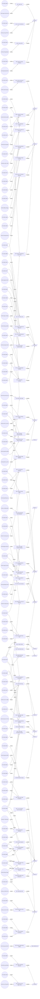

# Cve Flow

```mermaid
graph LR
    H10["H10: Tag Count"]
    CVE_2026_21680(("CVE-2026-21680"))
    CVE_2026_21680 -->|detects| H10
    GHSA_mgp7_w4w3_mhx4(("GHSA-mgp7-w4w3-mhx4"))
    GHSA_mgp7_w4w3_mhx4 -->|detects| H10
    CWE_20[/"CWE-20"/]
    H10 -->|classifies| CWE_20
    H101["H101: MPE Sub Element Channel Contin"]
    CVE_2026_21492(("CVE-2026-21492"))
    CVE_2026_21492 -->|detects| H101
    GHSA_xpq3_v3jj_mgvx(("GHSA-xpq3-v3jj-mgvx"))
    GHSA_xpq3_v3jj_mgvx -->|detects| H101
    CWE_787[/"CWE-787"/]
    H101 -->|classifies| CWE_787
    H102["H102: Tag Size Profile Size Cross Ch"]
    CVE_2026_21676(("CVE-2026-21676"))
    CVE_2026_21676 -->|detects| H102
    GHSA_j5vv_p2hv_c392(("GHSA-j5vv-p2hv-c392"))
    GHSA_j5vv_p2hv_c392 -->|detects| H102
    CWE_131[/"CWE-131"/]
    H102 -->|classifies| CWE_131
    H11["H11: CLUT Entry Limit"]
    CVE_2026_21677(("CVE-2026-21677"))
    CVE_2026_21677 -->|detects| H11
    CVE_2026_22255(("CVE-2026-22255"))
    CVE_2026_22255 -->|detects| H11
    CVE_2026_30986(("CVE-2026-30986"))
    CVE_2026_30986 -->|detects| H11
    CWE_190[/"CWE-190"/]
    H11 -->|classifies| CWE_190
    H114["H114: Curve Smoothness"]
    CVE_2026_21687(("CVE-2026-21687"))
    CVE_2026_21687 -->|detects| H114
    GHSA_prmm_g479_4fv7(("GHSA-prmm-g479-4fv7"))
    GHSA_prmm_g479_4fv7 -->|detects| H114
    H114 -->|classifies| CWE_20
    H12["H12: MPE Chain Depth"]
    CVE_2026_21500(("CVE-2026-21500"))
    CVE_2026_21500 -->|detects| H12
    CVE_2026_21501(("CVE-2026-21501"))
    CVE_2026_21501 -->|detects| H12
    GHSA_4h4j_mm9w_2cp4(("GHSA-4h4j-mm9w-2cp4"))
    GHSA_4h4j_mm9w_2cp4 -->|detects| H12
    CWE_674[/"CWE-674"/]
    H12 -->|classifies| CWE_674
    H128["H128: Version BCD"]
    CVE_2026_24403(("CVE-2026-24403"))
    CVE_2026_24403 -->|detects| H128
    GHSA_ph33_qp8j_5q34(("GHSA-ph33-qp8j-5q34"))
    GHSA_ph33_qp8j_5q34 -->|detects| H128
    H128 -->|classifies| CWE_20
    H131["H131: Profile Id MD5"]
    CVE_2022_26730(("CVE-2022-26730"))
    CVE_2022_26730 -->|detects| H131
    CWE_345[/"CWE-345"/]
    H131 -->|classifies| CWE_345
    H132["H132: Chad Determinant"]
    CVE_2022_26730 -->|detects| H132
    CWE_682[/"CWE-682"/]
    H132 -->|classifies| CWE_682
    H138["H138: Calculator Branching Depth"]
    CVE_2026_24407(("CVE-2026-24407"))
    CVE_2026_24407 -->|detects| H138
    CVE_2026_31793(("CVE-2026-31793"))
    CVE_2026_31793 -->|detects| H138
    GHSA_m6gx_93cp_4855(("GHSA-m6gx-93cp-4855"))
    GHSA_m6gx_93cp_4855 -->|detects| H138
    H138 -->|classifies| CWE_674
    H139["H139: TIFF Strip Geometry Validation"]
    CVE_2026_31797(("CVE-2026-31797"))
    CVE_2026_31797 -->|detects| H139
    GHSA_wh2p_cm3r_7hm3(("GHSA-wh2p-cm3r-7hm3"))
    GHSA_wh2p_cm3r_7hm3 -->|detects| H139
    CWE_122[/"CWE-122"/]
    H139 -->|classifies| CWE_122
    H142["H142: XML Serialization Safety"]
    CVE_2026_21498(("CVE-2026-21498"))
    CVE_2026_21498 -->|detects| H142
    CVE_2026_21499(("CVE-2026-21499"))
    CVE_2026_21499 -->|detects| H142
    CVE_2026_21500 -->|detects| H142
    H142 -->|classifies| CWE_787
    H143["H143: XML Array Bounds Precheck"]
    CVE_2026_21673(("CVE-2026-21673"))
    CVE_2026_21673 -->|detects| H143
    CVE_2026_21682(("CVE-2026-21682"))
    CVE_2026_21682 -->|detects| H143
    CVE_2026_22046(("CVE-2026-22046"))
    CVE_2026_22046 -->|detects| H143
    H143 -->|classifies| CWE_131
    H144["H144: XML String Termination Prechec"]
    CVE_2026_24852(("CVE-2026-24852"))
    CVE_2026_24852 -->|detects| H144
    CVE_2026_25502(("CVE-2026-25502"))
    CVE_2026_25502 -->|detects| H144
    CVE_2026_30983(("CVE-2026-30983"))
    CVE_2026_30983 -->|detects| H144
    CWE_170[/"CWE-170"/]
    H144 -->|classifies| CWE_170
    H145["H145: XML Curve Type Consistency"]
    CVE_2026_21493(("CVE-2026-21493"))
    CVE_2026_21493 -->|detects| H145
    CVE_2026_21689(("CVE-2026-21689"))
    CVE_2026_21689 -->|detects| H145
    CVE_2026_21690(("CVE-2026-21690"))
    CVE_2026_21690 -->|detects| H145
    CWE_843[/"CWE-843"/]
    H145 -->|classifies| CWE_843
    H146["H146: Stack Buffer Overflow GetValue"]
    CVE_2026_24404(("CVE-2026-24404"))
    CVE_2026_24404 -->|detects| H146
    CVE_2026_24406(("CVE-2026-24406"))
    CVE_2026_24406 -->|detects| H146
    GHSA_f79r_m9wh_wr6j(("GHSA-f79r-m9wh-wr6j"))
    GHSA_f79r_m9wh_wr6j -->|detects| H146
    CWE_121[/"CWE-121"/]
    H146 -->|classifies| CWE_121
    H147["H147: Null Pointer After Tag Read"]
    CVE_2021_30942(("CVE-2021-30942"))
    CVE_2021_30942 -->|detects| H147
    CVE_2022_26730 -->|detects| H147
    CVE_2026_24852 -->|detects| H147
    CWE_476[/"CWE-476"/]
    H147 -->|classifies| CWE_476
    H148["H148: Memory Copy Bounds Overlap"]
    CVE_2026_24407 -->|detects| H148
    CVE_2026_31793 -->|detects| H148
    GHSA_m6gx_93cp_4855 -->|detects| H148
    CWE_119[/"CWE-119"/]
    H148 -->|classifies| CWE_119
    H19["H19: Tag Offset Overlap"]
    CVE_2021_30942 -->|detects| H19
    CVE_2022_26730 -->|detects| H19
    H19 -->|classifies| CWE_122
    H20["H20: Tag Type Signature"]
    CVE_2026_21505(("CVE-2026-21505"))
    CVE_2026_21505 -->|detects| H20
    CVE_2026_24856(("CVE-2026-24856"))
    CVE_2026_24856 -->|detects| H20
    GHSA_j577_8285_qrf9(("GHSA-j577-8285-qrf9"))
    GHSA_j577_8285_qrf9 -->|detects| H20
    H20 -->|classifies| CWE_843
    H24["H24: Tag Struct Nesting Depth"]
    CVE_2026_30980(("CVE-2026-30980"))
    CVE_2026_30980 -->|detects| H24
    GHSA_w478_77q7_2hc2(("GHSA-w478-77q7-2hc2"))
    GHSA_w478_77q7_2hc2 -->|detects| H24
    H24 -->|classifies| CWE_674
    H25["H25: Tag Offset OOB"]
    CVE_2026_21487(("CVE-2026-21487"))
    CVE_2026_21487 -->|detects| H25
    GHSA_xq7x_9524_f7cp(("GHSA-xq7x-9524-f7cp"))
    GHSA_xq7x_9524_f7cp -->|detects| H25
    CWE_125[/"CWE-125"/]
    H25 -->|classifies| CWE_125
    H27["H27: MPE Matrix Output Channel"]
    CVE_2026_27692(("CVE-2026-27692"))
    CVE_2026_27692 -->|detects| H27
    GHSA_3869_prw8_gjqr(("GHSA-3869-prw8-gjqr"))
    GHSA_3869_prw8_gjqr -->|detects| H27
    H27 -->|classifies| CWE_131
    H28["H28: LUT Dimension Validation"]
    CVE_2026_21490(("CVE-2026-21490"))
    CVE_2026_21490 -->|detects| H28
    CVE_2026_21494(("CVE-2026-21494"))
    CVE_2026_21494 -->|detects| H28
    GHSA_9q9c_699q_xr2q(("GHSA-9q9c-699q-xr2q"))
    GHSA_9q9c_699q_xr2q -->|detects| H28
    CWE_400[/"CWE-400"/]
    H28 -->|classifies| CWE_400
    H29["H29: Colorant Table String Validati"]
    GHSA_4wqv_pvm8_5h27(("GHSA-4wqv-pvm8-5h27"))
    GHSA_4wqv_pvm8_5h27 -->|detects| H29
    CWE_125_CWE_170[/"CWE-125/CWE-170"/]
    H29 -->|classifies| CWE_125_CWE_170
    H30["H30: Gamut Boundary Desc Allocation"]
    GHSA_rc3h_95ph_j363(("GHSA-rc3h-95ph-j363"))
    GHSA_rc3h_95ph_j363 -->|detects| H30
    H30 -->|classifies| CWE_400
    H32["H32: Tag Data Type Confusion"]
    CVE_2021_30942 -->|detects| H32
    CVE_2026_21683(("CVE-2026-21683"))
    CVE_2026_21683 -->|detects| H32
    CVE_2026_21688(("CVE-2026-21688"))
    CVE_2026_21688 -->|detects| H32
    H32 -->|classifies| CWE_843
    H34["H34: Integer Overflow Sub-Element B"]
    CVE_2026_27691(("CVE-2026-27691"))
    CVE_2026_27691 -->|detects| H34
    GHSA_4gfj_4cjh_53v5(("GHSA-4gfj-4cjh-53v5"))
    GHSA_4gfj_4cjh_53v5 -->|detects| H34
    H34 -->|classifies| CWE_190
    H37["H37: Calculator Element Complexity"]
    CVE_2026_21507(("CVE-2026-21507"))
    CVE_2026_21507 -->|detects| H37
    CVE_2026_22047(("CVE-2026-22047"))
    CVE_2026_22047 -->|detects| H37
    CVE_2026_30979(("CVE-2026-30979"))
    CVE_2026_30979 -->|detects| H37
    H37 -->|classifies| CWE_400
    H39["H39: Shared Tag Data Aliasing Detec"]
    CVE_2022_26730 -->|detects| H39
    CWE_416[/"CWE-416"/]
    H39 -->|classifies| CWE_416
    H42["H42: Matrix Singularity Detection"]
    CVE_2026_30985(("CVE-2026-30985"))
    CVE_2026_30985 -->|detects| H42
    GHSA_f9wv_cq46_f9wg(("GHSA-f9wv-cq46-f9wg"))
    GHSA_f9wv_cq46_f9wg -->|detects| H42
    CWE_369[/"CWE-369"/]
    H42 -->|classifies| CWE_369
    H46["H46: TextDescription Unicode Length"]
    CVE_2026_21488(("CVE-2026-21488"))
    CVE_2026_21488 -->|detects| H46
    CVE_2026_21491(("CVE-2026-21491"))
    CVE_2026_21491 -->|detects| H46
    GHSA_4j2g_rvv4_86vg(("GHSA-4j2g-rvv4-86vg"))
    GHSA_4j2g_rvv4_86vg -->|detects| H46
    H46 -->|classifies| CWE_190
    H49["H49: Float s15Fixed16 NaN Inf Detec"]
    CVE_2026_21681(("CVE-2026-21681"))
    CVE_2026_21681 -->|detects| H49
    GHSA_v4qq_v3c3_x62x(("GHSA-v4qq-v3c3-x62x"))
    GHSA_v4qq_v3c3_x62x -->|detects| H49
    H49 -->|classifies| CWE_682
    H51["H51: LUT IO Channel Count Consisten"]
    CVE_2021_30942 -->|detects| H51
    H51 -->|classifies| CWE_125
    H54["H54: Division-by-Zero Trigger Detec"]
    CVE_2026_21495(("CVE-2026-21495"))
    CVE_2026_21495 -->|detects| H54
    GHSA_xhrm_79rg_5784(("GHSA-xhrm-79rg-5784"))
    GHSA_xhrm_79rg_5784 -->|detects| H54
    H54 -->|classifies| CWE_369
    H56["H56: Calculator Stack Depth"]
    CVE_2026_21501 -->|detects| H56
    GHSA_x7hw_h22p_2x4w(("GHSA-x7hw-h22p-2x4w"))
    GHSA_x7hw_h22p_2x4w -->|detects| H56
    H56 -->|classifies| CWE_400
    H58["H58: Sparse Matrix Entry Bounds"]
    CVE_2026_21503(("CVE-2026-21503"))
    CVE_2026_21503 -->|detects| H58
    GHSA_h554_qrfh_53gx(("GHSA-h554-qrfh-53gx"))
    GHSA_h554_qrfh_53gx -->|detects| H58
    CWE_126[/"CWE-126"/]
    H58 -->|classifies| CWE_126
    H63["H63: Curve LUT Channel Mismatch"]
    CVE_2026_21685(("CVE-2026-21685"))
    CVE_2026_21685 -->|detects| H63
    CVE_2026_21686(("CVE-2026-21686"))
    CVE_2026_21686 -->|detects| H63
    GHSA_792q_cqq9_mq4x(("GHSA-792q-cqq9-mq4x"))
    GHSA_792q_cqq9_mq4x -->|detects| H63
    H63 -->|classifies| CWE_131
    H64["H64: Named Color2Device Coord Overf"]
    CVE_2026_24406 -->|detects| H64
    GHSA_h9h3_45cm_j95f(("GHSA-h9h3-45cm-j95f"))
    GHSA_h9h3_45cm_j95f -->|detects| H64
    H64 -->|classifies| CWE_787
    H66["H66: Num Array NaN Inf Scan"]
    CVE_2026_21681 -->|detects| H66
    GHSA_v4qq_v3c3_x62x -->|detects| H66
    H66 -->|classifies| CWE_682
    H67["H67: Response Curve Set Bounds"]
    CVE_2026_24852 -->|detects| H67
    GHSA_q8g2_mp32_3j7f(("GHSA-q8g2-mp32-3j7f"))
    GHSA_q8g2_mp32_3j7f -->|detects| H67
    H67 -->|classifies| CWE_400
    H72["H72: Sparse Matrix Array Bounds"]
    CVE_2026_21503 -->|detects| H72
    CVE_2026_21505 -->|detects| H72
    GHSA_h554_qrfh_53gx -->|detects| H72
    H72 -->|classifies| CWE_843
    H74["H74: Tag Type Signature Consistency"]
    CVE_2021_30942 -->|detects| H74
    CVE_2026_21505 -->|detects| H74
    CVE_2026_24856 -->|detects| H74
    H74 -->|classifies| CWE_843
    H78["H78: CLUT Grid Dimension Overflow"]
    CVE_2026_21677 -->|detects| H78
    CVE_2026_22255 -->|detects| H78
    GHSA_95w5_jvqf_3994(("GHSA-95w5-jvqf-3994"))
    GHSA_95w5_jvqf_3994 -->|detects| H78
    H78 -->|classifies| CWE_190
    H79["H79: Load Tag Allocation Overflow"]
    CVE_2026_21485(("CVE-2026-21485"))
    CVE_2026_21485 -->|detects| H79
    GHSA_chp2_4gv5_2432(("GHSA-chp2-4gv5-2432"))
    GHSA_chp2_4gv5_2432 -->|detects| H79
    H79 -->|classifies| CWE_190
    H80["H80: Shared Tag Pointer UAF"]
    CVE_2026_21486(("CVE-2026-21486"))
    CVE_2026_21486 -->|detects| H80
    CVE_2026_21675(("CVE-2026-21675"))
    CVE_2026_21675 -->|detects| H80
    CVE_2026_30978(("CVE-2026-30978"))
    CVE_2026_30978 -->|detects| H80
    H80 -->|classifies| CWE_416
    H81["H81: MPE Calculator IO Consistency"]
    CVE_2026_21504(("CVE-2026-21504"))
    CVE_2026_21504 -->|detects| H81
    CVE_2026_22047 -->|detects| H81
    CVE_2026_22861(("CVE-2026-22861"))
    CVE_2026_22861 -->|detects| H81
    H81 -->|classifies| CWE_122
    H82["H82: IO Read Size Overflow"]
    CVE_2026_25582(("CVE-2026-25582"))
    CVE_2026_25582 -->|detects| H82
    CVE_2026_25583(("CVE-2026-25583"))
    CVE_2026_25583 -->|detects| H82
    CVE_2026_30987(("CVE-2026-30987"))
    CVE_2026_30987 -->|detects| H82
    H82 -->|classifies| CWE_190
    H83["H83: Float Numeric Array Size"]
    CVE_2026_25584(("CVE-2026-25584"))
    CVE_2026_25584 -->|detects| H83
    GHSA_xjr3_v3vr_5794(("GHSA-xjr3-v3vr-5794"))
    GHSA_xjr3_v3vr_5794 -->|detects| H83
    H83 -->|classifies| CWE_125
    H84["H84: LUT3D Transform Consistency"]
    CVE_2026_25585(("CVE-2026-25585"))
    CVE_2026_25585 -->|detects| H84
    CVE_2026_30982(("CVE-2026-30982"))
    CVE_2026_30982 -->|detects| H84
    CVE_2026_31795(("CVE-2026-31795"))
    CVE_2026_31795 -->|detects| H84
    H84 -->|classifies| CWE_125
    H85["H85: MPE Buffer Overlap"]
    CVE_2026_25634(("CVE-2026-25634"))
    CVE_2026_25634 -->|detects| H85
    GHSA_35rg_jcmp_583h(("GHSA-35rg-jcmp-583h"))
    GHSA_35rg_jcmp_583h -->|detects| H85
    H85 -->|classifies| CWE_122
    H86["H86: Localized Unicode Bounds"]
    CVE_2026_21678(("CVE-2026-21678"))
    CVE_2026_21678 -->|detects| H86
    CVE_2026_21679(("CVE-2026-21679"))
    CVE_2026_21679 -->|detects| H86
    GHSA_9rp2_4c6g_hppf(("GHSA-9rp2-4c6g-hppf"))
    GHSA_9rp2_4c6g_hppf -->|detects| H86
    H86 -->|classifies| CWE_787
    H87["H87: TRC Curve Anomaly"]
    CVE_2026_21489(("CVE-2026-21489"))
    CVE_2026_21489 -->|detects| H87
    GHSA_ph89_6q5h_wfw5(("GHSA-ph89-6q5h-wfw5"))
    GHSA_ph89_6q5h_wfw5 -->|detects| H87
    H87 -->|classifies| CWE_682
    H9["H9: Critical Text Tags"]
    CVE_2026_21496(("CVE-2026-21496"))
    CVE_2026_21496 -->|detects| H9
    CVE_2026_21497(("CVE-2026-21497"))
    CVE_2026_21497 -->|detects| H9
    GHSA_7gv7_cmrv_4j85(("GHSA-7gv7-cmrv-4j85"))
    GHSA_7gv7_cmrv_4j85 -->|detects| H9
    H9 -->|classifies| CWE_476
    H92["H92: Spectral Viewing Conditions"]
    CVE_2026_21684(("CVE-2026-21684"))
    CVE_2026_21684 -->|detects| H92
    GHSA_fg9m_j9x8_8279(("GHSA-fg9m-j9x8-8279"))
    GHSA_fg9m_j9x8_8279 -->|detects| H92
    H92 -->|classifies| CWE_20
    H95["H95: Sparse Matrix Array Bounds Val"]
    CVE_2026_21503 -->|detects| H95
    GHSA_h554_qrfh_53gx -->|detects| H95
    H95 -->|classifies| CWE_843
    H96["H96: Embedded Profile Validation"]
    CVE_2026_25503(("CVE-2026-25503"))
    CVE_2026_25503 -->|detects| H96
    GHSA_pf84_4c7q_x764(("GHSA-pf84-4c7q-x764"))
    GHSA_pf84_4c7q_x764 -->|detects| H96
    H96 -->|classifies| CWE_674

    classDef critical fill:#d32f2f,color:#fff,stroke:#b71c1c
    classDef high fill:#f57c00,color:#fff,stroke:#e65100
    classDef medium fill:#fbc02d,color:#000,stroke:#f9a825
```
