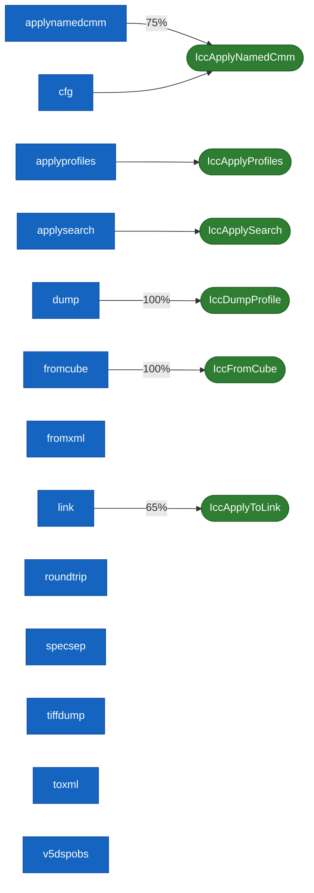

# Fuzzer Map

```mermaid
graph LR
    fuzzer_icc_applynamedcmm_fuzzer["applynamedcmm"]:::fuzzer
    comp_iccdev_tools_IccApplyNamedCmm(["IccApplyNamedCmm"]):::tool
    fuzzer_icc_applynamedcmm_fuzzer -->|75%| comp_iccdev_tools_IccApplyNamedCmm
    fuzzer_icc_applyprofiles_fuzzer["applyprofiles"]:::fuzzer
    comp_iccdev_tools_IccApplyProfiles(["IccApplyProfiles"]):::tool
    fuzzer_icc_applyprofiles_fuzzer --> comp_iccdev_tools_IccApplyProfiles
    fuzzer_icc_applysearch_fuzzer["applysearch"]:::fuzzer
    comp_iccdev_tools_IccApplySearch(["IccApplySearch"]):::tool
    fuzzer_icc_applysearch_fuzzer --> comp_iccdev_tools_IccApplySearch
    fuzzer_icc_cfg_fuzzer["cfg"]:::fuzzer
    comp_iccdev_tools_IccApplyNamedCmm(["IccApplyNamedCmm"]):::tool
    fuzzer_icc_cfg_fuzzer --> comp_iccdev_tools_IccApplyNamedCmm
    fuzzer_icc_dump_fuzzer["dump"]:::fuzzer
    comp_iccdev_tools_IccDumpProfile(["IccDumpProfile"]):::tool
    fuzzer_icc_dump_fuzzer -->|100%| comp_iccdev_tools_IccDumpProfile
    fuzzer_icc_fromcube_fuzzer["fromcube"]:::fuzzer
    comp_iccdev_tools_IccFromCube(["IccFromCube"]):::tool
    fuzzer_icc_fromcube_fuzzer -->|100%| comp_iccdev_tools_IccFromCube
    fuzzer_icc_fromxml_fuzzer["fromxml"]:::fuzzer
    fuzzer_icc_link_fuzzer["link"]:::fuzzer
    comp_iccdev_tools_IccApplyToLink(["IccApplyToLink"]):::tool
    fuzzer_icc_link_fuzzer -->|65%| comp_iccdev_tools_IccApplyToLink
    fuzzer_icc_roundtrip_fuzzer["roundtrip"]:::fuzzer
    fuzzer_icc_specsep_fuzzer["specsep"]:::fuzzer
    fuzzer_icc_tiffdump_fuzzer["tiffdump"]:::fuzzer
    fuzzer_icc_toxml_fuzzer["toxml"]:::fuzzer
    fuzzer_icc_v5dspobs_fuzzer["v5dspobs"]:::fuzzer

    classDef fuzzer fill:#1565c0,color:#fff,stroke:#0d47a1
    classDef tool fill:#2e7d32,color:#fff,stroke:#1b5e20
```
