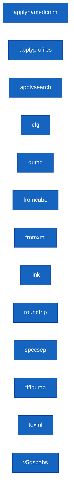

# Fuzzer Map

```mermaid
graph LR
    fuzzer_icc_applynamedcmm_fuzzer["applynamedcmm"]:::fuzzer
    fuzzer_icc_applyprofiles_fuzzer["applyprofiles"]:::fuzzer
    fuzzer_icc_applysearch_fuzzer["applysearch"]:::fuzzer
    fuzzer_icc_cfg_fuzzer["cfg"]:::fuzzer
    fuzzer_icc_dump_fuzzer["dump"]:::fuzzer
    fuzzer_icc_fromcube_fuzzer["fromcube"]:::fuzzer
    fuzzer_icc_fromxml_fuzzer["fromxml"]:::fuzzer
    fuzzer_icc_link_fuzzer["link"]:::fuzzer
    fuzzer_icc_roundtrip_fuzzer["roundtrip"]:::fuzzer
    fuzzer_icc_specsep_fuzzer["specsep"]:::fuzzer
    fuzzer_icc_tiffdump_fuzzer["tiffdump"]:::fuzzer
    fuzzer_icc_toxml_fuzzer["toxml"]:::fuzzer
    fuzzer_icc_v5dspobs_fuzzer["v5dspobs"]:::fuzzer

    classDef fuzzer fill:#1565c0,color:#fff,stroke:#0d47a1
    classDef tool fill:#2e7d32,color:#fff,stroke:#1b5e20
```
