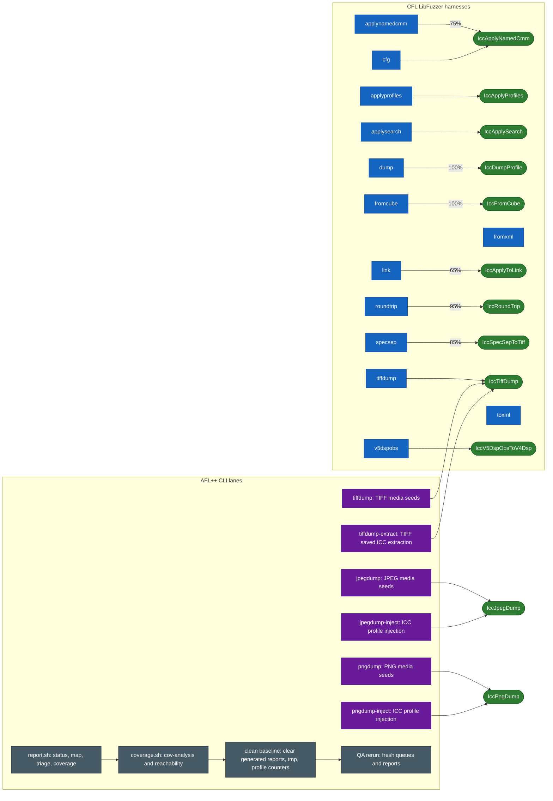

# Fuzzer Map

This map separates library-level CFL harnesses from AFL++ CLI lanes. AFL lanes
use real tool argv shapes from `afl/targets.sh`; injection lanes fuzz embedded
ICC profile bytes through fixed media, while dump lanes fuzz the media file
itself.

