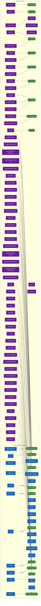

# Fuzzer Map

```mermaid
graph LR
    subgraph CFL["CFL LibFuzzer harnesses"]
    fuzzer_icc_applynamedcmm_fuzzer["applynamedcmm"]:::fuzzer
    comp_iccdev_tools_IccApplyNamedCmm(["IccApplyNamedCmm"]):::tool
    fuzzer_icc_applynamedcmm_fuzzer -->|75%| comp_iccdev_tools_IccApplyNamedCmm
    fuzzer_icc_applyprofiles_fuzzer["applyprofiles"]:::fuzzer
    comp_iccdev_tools_IccApplyProfiles(["IccApplyProfiles"]):::tool
    fuzzer_icc_applyprofiles_fuzzer --> comp_iccdev_tools_IccApplyProfiles
    fuzzer_icc_applyprofiles_row_fuzzer["applyprofiles_row"]:::fuzzer
    fuzzer_icc_applysearch_fuzzer["applysearch"]:::fuzzer
    comp_iccdev_tools_IccApplySearch(["IccApplySearch"]):::tool
    fuzzer_icc_applysearch_fuzzer --> comp_iccdev_tools_IccApplySearch
    fuzzer_icc_applysearch_weight_fuzzer["applysearch_weight"]:::fuzzer
    fuzzer_icc_cfg_fuzzer["cfg"]:::fuzzer
    fuzzer_icc_cfg_fuzzer --> comp_iccdev_tools_IccApplyNamedCmm
    fuzzer_icc_connect_fuzzer["connect"]:::fuzzer
    fuzzer_icc_dump_fuzzer["dump"]:::fuzzer
    comp_iccdev_tools_IccDumpProfile(["IccDumpProfile"]):::tool
    fuzzer_icc_dump_fuzzer -->|100%| comp_iccdev_tools_IccDumpProfile
    fuzzer_icc_fromcube_fuzzer["fromcube"]:::fuzzer
    comp_iccdev_tools_IccFromCube(["IccFromCube"]):::tool
    fuzzer_icc_fromcube_fuzzer -->|100%| comp_iccdev_tools_IccFromCube
    fuzzer_icc_fromjson_fuzzer["fromjson"]:::fuzzer
    fuzzer_icc_fromxml_fuzzer["fromxml"]:::fuzzer
    fuzzer_icc_heifdump_fuzzer["heifdump"]:::fuzzer
    fuzzer_icc_jpegdump_fuzzer["jpegdump"]:::fuzzer
    fuzzer_icc_link_fuzzer["link"]:::fuzzer
    comp_iccdev_tools_IccApplyToLink(["IccApplyToLink"]):::tool
    fuzzer_icc_link_fuzzer -->|65%| comp_iccdev_tools_IccApplyToLink
    fuzzer_icc_pawgreport_fuzzer["pawgreport"]:::fuzzer
    fuzzer_icc_pngdump_fuzzer["pngdump"]:::fuzzer
    fuzzer_icc_profilevisualize_fuzzer["profilevisualize"]:::fuzzer
    fuzzer_icc_proflib_fuzzer["proflib"]:::fuzzer
    fuzzer_icc_roundtrip_fuzzer["roundtrip"]:::fuzzer
    comp_iccdev_tools_IccRoundTrip(["IccRoundTrip"]):::tool
    fuzzer_icc_roundtrip_fuzzer -->|95%| comp_iccdev_tools_IccRoundTrip
    fuzzer_icc_specsep_fuzzer["specsep"]:::fuzzer
    comp_iccdev_tools_IccSpecSepToTiff(["IccSpecSepToTiff"]):::tool
    fuzzer_icc_specsep_fuzzer -->|85%| comp_iccdev_tools_IccSpecSepToTiff
    fuzzer_icc_tiffdump_fuzzer["tiffdump"]:::fuzzer
    comp_iccdev_tools_IccTiffDump(["IccTiffDump"]):::tool
    fuzzer_icc_tiffdump_fuzzer --> comp_iccdev_tools_IccTiffDump
    fuzzer_icc_tojson_fuzzer["tojson"]:::fuzzer
    fuzzer_icc_toxml_fuzzer["toxml"]:::fuzzer
    fuzzer_icc_v5dspobs_fuzzer["v5dspobs"]:::fuzzer
    comp_iccdev_tools_IccV5DspObsToV4Dsp(["IccV5DspObsToV4Dsp"]):::tool
    fuzzer_icc_v5dspobs_fuzzer --> comp_iccdev_tools_IccV5DspObsToV4Dsp
    end
    subgraph AFL["AFL++ CLI lanes"]
    afl_applynamedcmm["applynamedcmm"]:::afl
    afl_applynamedcmm --> comp_iccdev_tools_IccApplyNamedCmm
    afl_applynamedcmm_cfg["applynamedcmm-cfg"]:::afl
    afl_applynamedcmm_cfg --> comp_iccdev_tools_IccApplyNamedCmm
    afl_applynamedcmm_debugcalc["applynamedcmm-debugcalc"]:::afl
    afl_applynamedcmm_debugcalc --> comp_iccdev_tools_IccApplyNamedCmm
    afl_applynamedcmm_hybrid_chain["applynamedcmm-hybrid-chain"]:::afl
    afl_applynamedcmm_hybrid_chain --> comp_iccdev_tools_IccApplyNamedCmm
    afl_applynamedcmm_v5_brdf["applynamedcmm-v5-brdf"]:::afl
    afl_applynamedcmm_v5_brdf --> comp_iccdev_tools_IccApplyNamedCmm
    afl_applyprofiles["applyprofiles"]:::afl
    afl_applyprofiles --> comp_iccdev_tools_IccApplyProfiles
    afl_applyprofiles_cfg["applyprofiles-cfg"]:::afl
    afl_applyprofiles_cfg --> comp_iccdev_tools_IccApplyProfiles
    afl_applyprofiles_deep["applyprofiles-deep"]:::afl
    afl_applyprofiles_deep --> comp_iccdev_tools_IccApplyProfiles
    afl_applyprofiles_fast["applyprofiles-fast"]:::afl
    afl_applyprofiles_fast --> comp_iccdev_tools_IccApplyProfiles
    afl_applyprofiles_row["applyprofiles-row"]:::afl
    afl_applyprofiles_row --> comp_iccdev_tools_IccApplyProfiles
    afl_applyprofiles_search["applyprofiles-search"]:::afl
    afl_applyprofiles_search --> comp_iccdev_tools_IccApplyProfiles
    afl_applysearch["applysearch"]:::afl
    afl_applysearch --> comp_iccdev_tools_IccApplySearch
    afl_applysearch_cfg["applysearch-cfg"]:::afl
    afl_applysearch_cfg --> comp_iccdev_tools_IccApplySearch
    afl_applysearch_fast["applysearch-fast"]:::afl
    afl_applysearch_fast --> comp_iccdev_tools_IccApplySearch
    afl_applysearch_noinit["applysearch-noinit"]:::afl
    afl_applysearch_noinit --> comp_iccdev_tools_IccApplySearch
    afl_applysearch_weight_nan["applysearch-weight-nan"]:::afl
    afl_applysearch_weight_nan --> comp_iccdev_tools_IccApplySearch
    afl_applysearch_weight_negative["applysearch-weight-negative"]:::afl
    afl_applysearch_weight_negative --> comp_iccdev_tools_IccApplySearch
    afl_applysearch_weight_positive["applysearch-weight-positive"]:::afl
    afl_applysearch_weight_positive --> comp_iccdev_tools_IccApplySearch
    afl_applysearch_weight_positive_fast["applysearch-weight-positive-fast"]:::afl
    afl_applysearch_weight_positive_fast --> comp_iccdev_tools_IccApplySearch
    afl_applysearch_weight_zero["applysearch-weight-zero"]:::afl
    afl_applysearch_weight_zero --> comp_iccdev_tools_IccApplySearch
    afl_applytolink["applytolink"]:::afl
    afl_applytolink --> comp_iccdev_tools_IccApplyToLink
    afl_applytolink_cube["applytolink-cube"]:::afl
    afl_applytolink_cube --> comp_iccdev_tools_IccApplyToLink
    afl_applytolink_v5["applytolink-v5"]:::afl
    afl_applytolink_v5 --> comp_iccdev_tools_IccApplyToLink
    afl_benchapply["benchapply"]:::afl
    comp_iccdev_tools_IccBenchApply(["IccBenchApply"]):::tool
    afl_benchapply --> comp_iccdev_tools_IccBenchApply
    afl_dump["dump"]:::afl
    afl_dump --> comp_iccdev_tools_IccDumpProfile
    afl_dump_diag["dump-diag"]:::afl
    afl_dump_diag --> comp_iccdev_tools_IccDumpProfile
    afl_dump_read["dump-read"]:::afl
    afl_dump_read --> comp_iccdev_tools_IccDumpProfile
    afl_fromcube["fromcube"]:::afl
    afl_fromcube --> comp_iccdev_tools_IccFromCube
    afl_fromjson["fromjson"]:::afl
    comp_iccdev_tools_IccFromJson(["IccFromJson"]):::tool
    afl_fromjson --> comp_iccdev_tools_IccFromJson
    afl_fromjson_noid["fromjson-noid"]:::afl
    afl_fromjson_noid --> comp_iccdev_tools_IccFromJson
    afl_fromxml["fromxml"]:::afl
    afl_fromxml_includes["fromxml-includes"]:::afl
    afl_fromxml_noid["fromxml-noid"]:::afl
    afl_heifdump["heifdump"]:::afl
    comp_iccdev_tools_IccHeifDump(["IccHeifDump"]):::tool
    afl_heifdump --> comp_iccdev_tools_IccHeifDump
    afl_heifdump_extract["heifdump-extract"]:::afl
    afl_heifdump_extract --> comp_iccdev_tools_IccHeifDump
    afl_jpegdump["jpegdump"]:::afl
    comp_iccdev_tools_IccJpegDump(["IccJpegDump"]):::tool
    afl_jpegdump --> comp_iccdev_tools_IccJpegDump
    afl_jpegdump_inject["jpegdump-inject"]:::afl
    afl_jpegdump_inject --> comp_iccdev_tools_IccJpegDump
    afl_pawgreport["pawgreport"]:::afl
    comp_iccdev_tools_IccPawgReport(["IccPawgReport"]):::tool
    afl_pawgreport --> comp_iccdev_tools_IccPawgReport
    afl_pawgreport_fast["pawgreport-fast"]:::afl
    afl_pawgreport_fast --> comp_iccdev_tools_IccPawgReport
    afl_pngdump["pngdump"]:::afl
    comp_iccdev_tools_IccPngDump(["IccPngDump"]):::tool
    afl_pngdump --> comp_iccdev_tools_IccPngDump
    afl_pngdump_inject["pngdump-inject"]:::afl
    afl_pngdump_inject --> comp_iccdev_tools_IccPngDump
    afl_profileplot["profileplot"]:::afl
    comp_iccdev_tools_IccProfilePlot(["IccProfilePlot"]):::tool
    afl_profileplot --> comp_iccdev_tools_IccProfilePlot
    afl_profileplot_graph["profileplot-graph"]:::afl
    afl_profileplot_graph --> comp_iccdev_tools_IccProfilePlot
    afl_profileplot_raster["profileplot-raster"]:::afl
    afl_profileplot_raster --> comp_iccdev_tools_IccProfilePlot
    afl_profilevisualize["profilevisualize"]:::afl
    comp_iccdev_tools_IccProfileVisualize(["IccProfileVisualize"]):::tool
    afl_profilevisualize --> comp_iccdev_tools_IccProfileVisualize
    afl_profilevisualize_fast["profilevisualize-fast"]:::afl
    afl_profilevisualize_fast --> comp_iccdev_tools_IccProfileVisualize
    afl_roundtrip["roundtrip"]:::afl
    afl_roundtrip --> comp_iccdev_tools_IccRoundTrip
    afl_roundtrip_mpe["roundtrip-mpe"]:::afl
    afl_roundtrip_mpe --> comp_iccdev_tools_IccRoundTrip
    afl_specseptotiff["specseptotiff"]:::afl
    afl_specseptotiff --> comp_iccdev_tools_IccSpecSepToTiff
    afl_specseptotiff_bigtiff["specseptotiff-bigtiff"]:::afl
    afl_specseptotiff_bigtiff --> comp_iccdev_tools_IccSpecSepToTiff
    afl_specseptotiff_compress["specseptotiff-compress"]:::afl
    afl_specseptotiff_compress --> comp_iccdev_tools_IccSpecSepToTiff
    afl_specseptotiff_desc["specseptotiff-desc"]:::afl
    afl_specseptotiff_desc --> comp_iccdev_tools_IccSpecSepToTiff
    afl_specseptotiff_harvest["specseptotiff-harvest"]:::afl
    afl_specseptotiff_harvest --> comp_iccdev_tools_IccSpecSepToTiff
    afl_specseptotiff_sep["specseptotiff-sep"]:::afl
    afl_specseptotiff_sep --> comp_iccdev_tools_IccSpecSepToTiff
    afl_specseptotiff_short["specseptotiff-short"]:::afl
    afl_specseptotiff_short --> comp_iccdev_tools_IccSpecSepToTiff
    afl_specseptotiff_tiff["specseptotiff-tiff"]:::afl
    afl_specseptotiff_tiff --> comp_iccdev_tools_IccSpecSepToTiff
    afl_specseptotiff_tiles["specseptotiff-tiles"]:::afl
    afl_specseptotiff_tiles --> comp_iccdev_tools_IccSpecSepToTiff
    afl_tiffdump["tiffdump"]:::afl
    afl_tiffdump --> comp_iccdev_tools_IccTiffDump
    afl_tiffdump_extract["tiffdump-extract"]:::afl
    afl_tiffdump_extract --> comp_iccdev_tools_IccTiffDump
    afl_tiffdump_ifd["tiffdump-ifd"]:::afl
    afl_tiffdump_ifd --> comp_iccdev_tools_IccTiffDump
    afl_tiffdump_list["tiffdump-list"]:::afl
    afl_tiffdump_list --> comp_iccdev_tools_IccTiffDump
    afl_tojson["tojson"]:::afl
    comp_iccdev_tools_IccToJson(["IccToJson"]):::tool
    afl_tojson --> comp_iccdev_tools_IccToJson
    afl_toxml["toxml"]:::afl
    afl_toxml_fast["toxml-fast"]:::afl
    afl_v5dspobs["v5dspobs"]:::afl
    afl_v5dspobs --> comp_iccdev_tools_IccV5DspObsToV4Dsp
    end

    classDef fuzzer fill:#1565c0,color:#fff,stroke:#0d47a1
    classDef afl fill:#6a1b9a,color:#fff,stroke:#4a148c
    classDef tool fill:#2e7d32,color:#fff,stroke:#1b5e20
```
